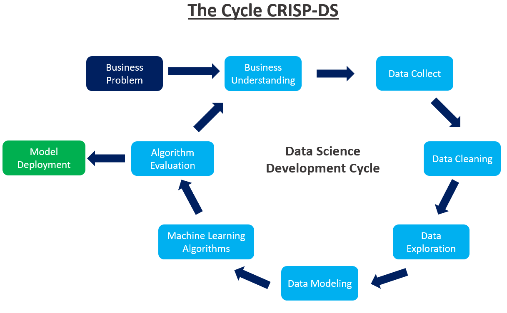
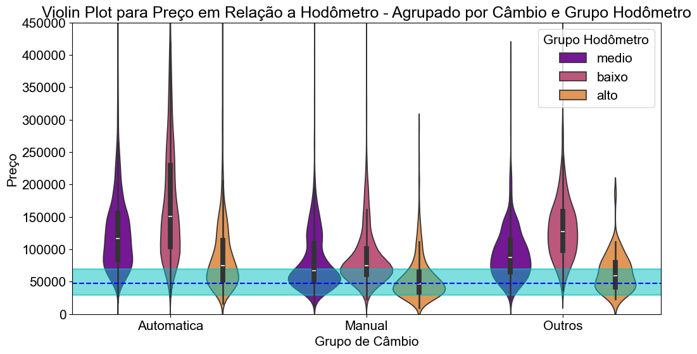
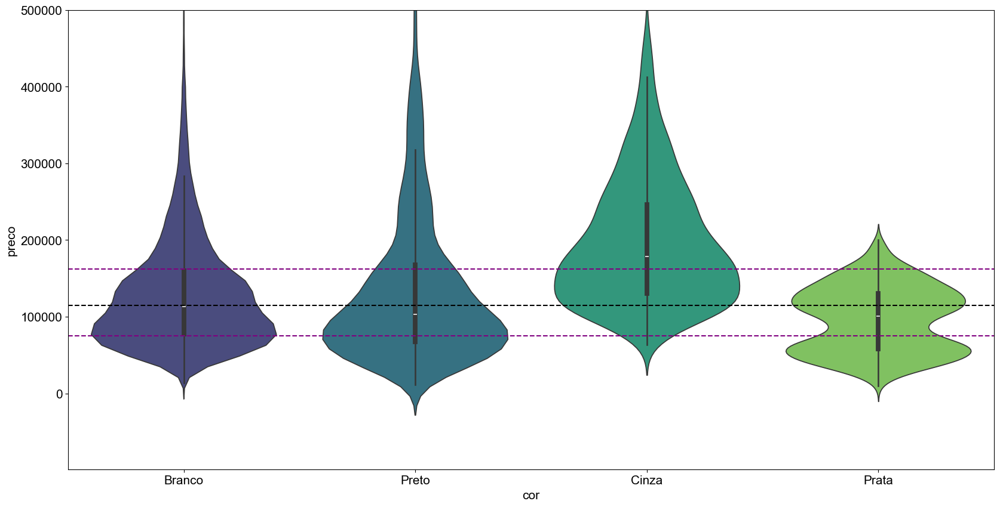
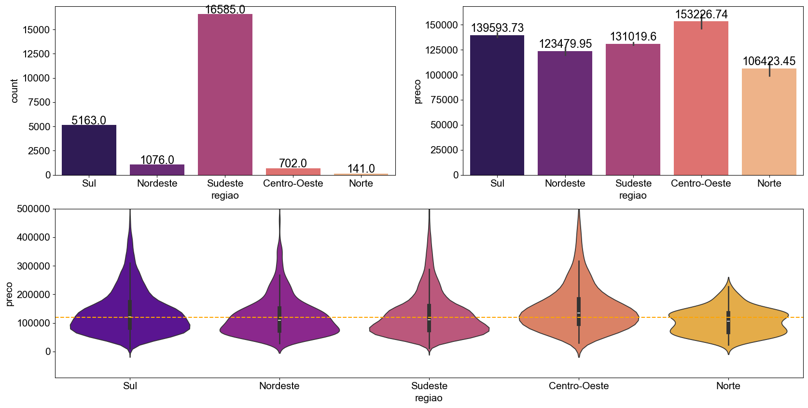

# Cars Price Prediction

## Predicting prices for used cars

*Image created with Leonardo.AI.*

## 1. Business Problem

The Auto Cars is a company whose core business involves dealing with used cars. In order to maintain competitive prices in the market, it has acquired a dataset from a marketplace that includes transactions related to used cars in Brazil.

Project objective: create analysis to explore, understand and create insights about the business problem; and create a machine learning model to predict prices for used cars.

 

## 2. Business Assumptions

 The assumptions about the business problem is as follows: 

<ul>
    <li>The solution only consists of data from the marketplace dataset.</li>
    <li>The column <code>veiculo_alienado</code> was removed because all values are the same, so it doesn't provide information for analysis and the machine learning model.</li>
    <li>The column <code>elegivel_revisao</code> was removed for the same reason.</li>
    <li>If a car with a value of 0 in <code>cilindradas</code> is considered an electric car.</li>
</ul>

 

## 3. Project management method

I used the CRISP-DM method (Cross Industry Standard Process - Data Science) due to the quick delivery of value and the ability to map issues. The cyclical approach of CRISP-DM allows to obtain a complete solution in one cycle, generating efficient and agile results for the business.  

 

 

## 4. Solution Strategy

<b> Step 1 - Data Description:</b> My goal is to use statistics metrics to identify data outside the scope of business. 
  

<b> Step 2 - Feature Engineering:</b> Derive new attributes based on the original variables to better describe the phenomenon that will be modeled. 
 

<b> Step 3 - Data Filtering:</b> Filter rows and select columns that do not contain information for modeling or that do not match the scope of the business. 
 

<b> Step 4 - Exploratory Data Analysis (EDA):</b> Explore the data to find insights and better understand the impact of variables on model learning. 
 

<b> Step 5 - Data Preparation:</b> Prepare the data so that the Machine Learning models can learn the specific behavior. 
 

<b> Step 6 - Feature Selection:</b> Selection of the most significant attributes for training the model. 
 

<b> Step 7 - Machine Learning Modeling:</b> Machine Learning model training. 
 

<b> Step 8 - Hyper Parameter Fine Tuning:</b> Choose the best values for each of the parameters of the model selected from the previous step. 
 

<b> Step 9 - Model Evaluation:</b> Convert the performance of the Machine Learning model into business result. 
 

<b> Step 10 - Deployment:</b> Publish the model in a cloud environment so that other people or services can use the results to improve the business decision. 
 

 

## 5. Top 3 Data Insights

### <b> Hypotesis 1:</b> Cars with manual transmission and higher odometer readings have lower prices.

<b> True.</b> Cars with manual transmission and higher odometer readings have LOWER prices! 

 It is notable that the group of vehicles with manual transmission and high odometer readings presents the lowest prices, as, upon analyzing the violin plot medians, this group displays the lowest value. Additionally, about 50% of the vehicles in this verified category (manual transmission and high odometer readings) have prices lower than 75% of the vehicles in the other violins. 

 

### <b> Hypotesis 2:</b> White-colored cars have higher prices.

<b> False.</b> Gray-colored cars have higher prices. 

 It is noted that gray-colored vehicles are the ones with higher prices. The median (Q2) of the White color is below Q1 of the Gray color, meaning that 75% of gray-colored vehicles have prices higher than 50% of white-colored vehicles. The gray color also overlaps with the other colors. 

 

### <b> Hypotesis 3:</b> Cars from the Southeast region have higher average prices.

<b> False.</b> Cars from the Midwest region have the highest average prices. 

 Observing the graphs, it is evident that the Midwest region has the highest average value, and its confidence interval is reasonable compared to other regions. Additionally, the median (Q2) of the Midwest is also the highest among the violins. 

 

## 6. Machine Learning Models Applied

 Tests were made using different algorithms, such as: 

<ul>
    <li>XGBoost Regressor</li>
    <li>Random Forest Regressor</li>
    <li>Linear Regression</li>
    <li>Linear Regression - Lasso</li>
    <li>Decision Tree Regressor</li>
    <li>Average Model</li>
</ul>

 

## 7. Machine Learning Performance

 The MAE, MAPE and RMSE metrics evaluated the performance of the models. 

 I performed a single test to verify the linearity of the problem. 

<table border="1" class="dataframe">
  <thead>
    <tr style="text-align: right;">
      <th></th>
      <th>Model Name</th>
      <th>MAE</th>
      <th>MAPE</th>
      <th>RMSE</th>
    </tr>
  </thead>
  <tbody>
    <tr>
      <th>0</th>
      <td>Random Forest Regressor</td>
      <td>27234.595</td>
      <td>0.222</td>
      <td>41625.305</td>
    </tr>
    <tr>
      <th>0</th>
      <td>XGBoost Regressor</td>
      <td>26897.101</td>
      <td>0.218</td>
      <td>41685.274</td>
    </tr>
    <tr>
      <th>0</th>
      <td>Linear Regression</td>
      <td>31064.729</td>
      <td>0.254</td>
      <td>47756.379</td>
    </tr>
    <tr>
      <th>0</th>
      <td>Linear Regression - Lasso</td>
      <td>32381.555</td>
      <td>0.266</td>
      <td>49877.338</td>
    </tr>
    <tr>
      <th>0</th>
      <td>Decision Tree Regressor</td>
      <td>37186.524</td>
      <td>0.306</td>
      <td>58231.145</td>
    </tr>
    <tr>
      <th>0</th>
      <td>Average Model</td>
      <td>58974.480</td>
      <td>0.608</td>
      <td>79653.492</td>
    </tr>
  </tbody>
</table>

 

 To know the real performance of the model, I applied the Cross Validation technique. 

<table border="1" class="dataframe">
  <thead>
    <tr style="text-align: right;">
      <th></th>
      <th>Model Name</th>
      <th>MAE CV</th>
      <th>MAPE CV</th>
      <th>RMSE CV</th>
    </tr>
  </thead>
  <tbody>
    <tr>
      <th>0</th>
      <td>XGBoost</td>
      <td>26765.37 +/- 511.927875</td>
      <td>0.215 +/- 0.001956</td>
      <td>43048.82 +/- 3084.745074</td>
    </tr>
    <tr>
      <th>0</th>
      <td>Random Forest Regressor</td>
      <td>26944.15 +/- 449.169727</td>
      <td>0.217 +/- 0.001813</td>
      <td>43657.44 +/- 3416.05988</td>
    </tr>
    <tr>
      <th>0</th>
      <td>Linear Regression</td>
      <td>31796.89 +/- 500.667377</td>
      <td>0.253 +/- 0.001976</td>
      <td>51222.13 +/- 2988.911712</td>
    </tr>
    <tr>
      <th>0</th>
      <td>Decision Tree Regressor</td>
      <td>36891.19 +/- 1030.538673</td>
      <td>0.305 +/- 0.00682</td>
      <td>58846.47 +/- 4150.006351</td>
    </tr>
    <tr>
      <th>0</th>
      <td>Lasso</td>
      <td>57385.15 +/- 748.484266</td>
      <td>0.505 +/- 0.005208</td>
      <td>84444.63 +/- 3154.7482</td>
    </tr>
  </tbody>
</table>

 
The XGBoost algorithm achieves the best performance, so I decided to proceed with it for fine-tuning, further improving the performance.

 

## 8. Deployment

 I developed a Streamlit panel page that returns to the user the suggested price and some stats about the selected car and similar ones. 

*Try it yourself! You can access the Auto Cars Tool clicking the link below:*

*https://cars-price-predict-infinity-cars.streamlit.app*

 

 The trained machine learning model is in an API that I created and hosted on Render Cloud as a free web service. Therefore, when Streamlit sends the car's characteristics to the API, it returns the predicted/suggested value that is shown to the user. 

*The API is online on Render Cloud.*

 

Below you can see the schematic of the deployment architecture:

*Deployment architecture schematic.*

 

## 9. Business Results

 
Due to being an analysis of a acquired dataset, it is not possible in this case to estimate a financial return for the company. However, a model capable of pricing vehicles based on their characteristics, and demonstrating better performance than the current average baseline, can make the company more competitive in the market, thereby increasing its chances of success in the field.

 

## 10. Conclusion

I conducted exploratory data analysis, gained insights relevant to the business, developed a suggested pricing model with satisfactory performance, and deployed the model for any company user to access at any moment for making predictions.

Therefore, I successfully achieved the project's objective of predicting car prices, making it more competitive through a data-driven business solution.

 

## 11. Next Steps to Improve
<ul>
  <li> Create a new column into dataset with the FIPE price for all cars to improve the machine learning model.</li>
  <li> Add an inflation adjustment factor to the dataset to account for changes in purchasing power over time, enhancing the performance of the machine learning model.</li>
  <li> Investigate model underperformance in specific cars and resolve identified issues. </li>
  <li> Build a model retraining pipeline. </li>
</ul>

 

Thanks for reading!